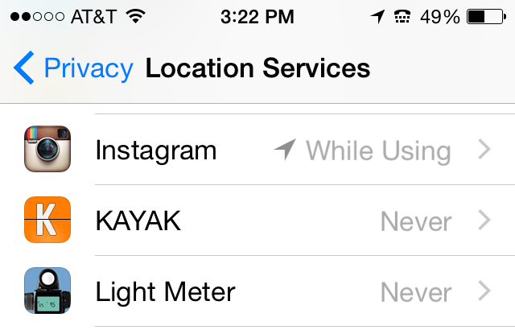
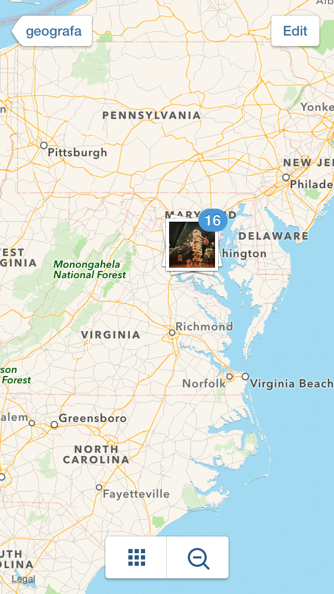

## Picloco

A little application that combines the [Mapbox GL JS API](https://www.mapbox.com/mapbox-gl-js/api/) with location 
info from [Instagram's API](https://instagram.com/developer/). The application contains a basic Mapbox map that uses 
geolocation and the map's center to make requests to Instagram's API and pull in photos that 
are publicly shared. The query looks for public media within an 80 meter radius of the center. Site not working? It could've hit a rate limit with Instagram.

Privacy concerns? Opt out of Instagram services in your Privacy settings:

Or relocate images directly in the Instagram application:

